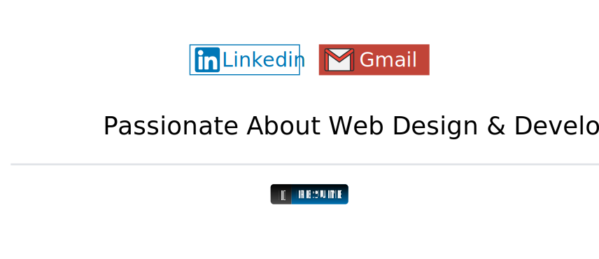

    

    <h2 align="center">Jeff A. Hudson &mdash; Hudson Design Studio</h2>
    
We build awesome websites!

 

I am the ower/operator of Hudson Design Studio. We build custom designed websites tailored to meet our clients needs.

We offer the following services:
* Web development
* Web design
* Graphic design
* Logo design
* Audio services
* Video Editing

---

<!-- markdownlint-disable MD033 -->

    
&#127942 <b>GitHub Awards</b>
 

    
&#9889 <b>GitHub Stats</b>
 

 

    
:computer: <b>Top Languages</b>
 

    

    
&#9889 <b>GitHub Recent Activity</b>
 

    
<!--START_SECTION:activity-->
<!--END_SECTION:activity-->

 

<!-- markdownlint-enable MD033 -->

### Recent Activity

<!--START_SECTION:activity-->
<!--END_SECTION:activity-->

 

 

---

<h3>Languages:</h3>

	
	
	
	
	
	
	
	
	
	
	
	
	

<h3>Content Management Systems:</h3>

    
    

<h3>Version Control:</h3>

    	
	
	
	

<h3>IDE, Text Editors &amp; Command Line Tools:</h3>

    	
	
	
	
	
	
	
	
	
	
	
	

<h3>Software:</h3>

    
    
    
    
    
    
    
    
    
    
    
    
    

<h3>Project Management:</h3>

    
    

<h3>Hosting &amp; Services:</h3>

    
    
    
    
    
    

---

    

	

